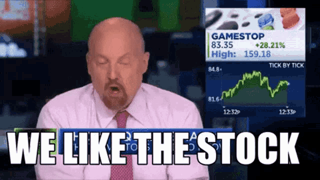
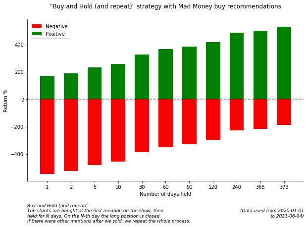

# Backtesting the "Cramer Effect" & Recommendations from Cramer

</a>

**Recommendations from Cramer**: On the show [Mad-Money](https://www.cnbc.com/mad-money/) (CNBC)
[Jim Cramer](https://en.wikipedia.org/wiki/Jim_Cramer) picks stocks which he recommends to buy. We will use this
data to build a portfolio

**The Cramer-effect/Cramer-bounce**: After the show *Mad Money* the recommended stocks are bought by viewers almost
immediately (afterhours trading) or on the next day at market open, increasing the price for a short period of time.

[You can read about the setup and results in my Blog Post](https://www.gaborvecsei.com/Mad-Money-Backtesting/)

You can also access the data easily with the
[Flat Data Viewer](https://flatgithub.com/gaborvecsei/Mad-Money-Backtesting)

# How to use this repo

- **Automatic data scraping** *(with Github Actions)*: Every day at 00:00 the `scrape_mad_money.py` tool runs
    and commits the data (if there was a change) to this repo. Feel free to use the created `.csv` file for your own projects
    - *(Why do we scrape the whole data range every day?)*: This way we can see the changes from commit to commit.
    If anything happens which would alter the historical data, we would be aware.
- **("manual") Data scraping**: Use the `scrape_mad_money.py` to get the buy and sell recommendations Cramer made over the years
    - Result is a `.csv` file which you can use
- **Backtesting the buy calls**: Use the notebook `mad_money_backtesting.ipynb`
    - To add your backtesting strategy, go to the `backtesting_strategies.py` file and implement yours based on the
    existing ones

*Warning: code quality is just "mehh", I did not pay much attention here, this is just a quick experiment*

# Backtesting

In the notebook there are notes how the experiment(s) were conducted and facts, limitations about the approach.
You can also add your own approaches.

**Available Strategies:**
- `BuyAndHold` (and repeat)
- `AfterShowBuyNextDayCloseSell`
- `AfterShowBuyNextDayOpenSell`
- `NextDayOpenBuyNextDayCloseSell`

## Buy and Hold (and repeat) Results

</a>

</a>

## How is this different from the real-life scenario?

We backtest each mentioned stock individually, then aggregate the results.
We define a cash amount for each symbol separately (e.g. $1k) and not an overall budget.
This change should not alter the expected returns (in %) much if we assume you have infinite money, so you can
put your money in each of the mentioned stocks every day.

As we don't have (free) complete after-hours trading data, the scenario when we "buy at the end of the Mad Money Show"
is approximated with the value of the stock value at market close. This obviously alters the end result for the short
term experiments if a stock has high daily volatility and it changes a lot afterhours.
(Of course the "buy at next trading day open" is not effected by this, only if we count on the after hours data).

